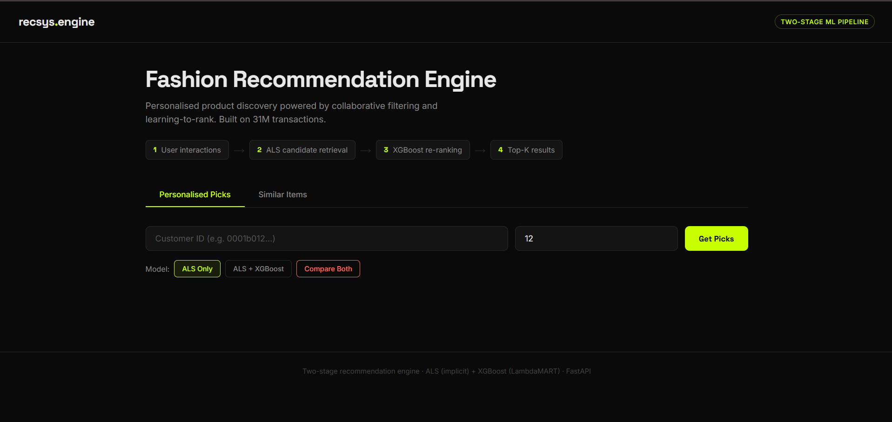
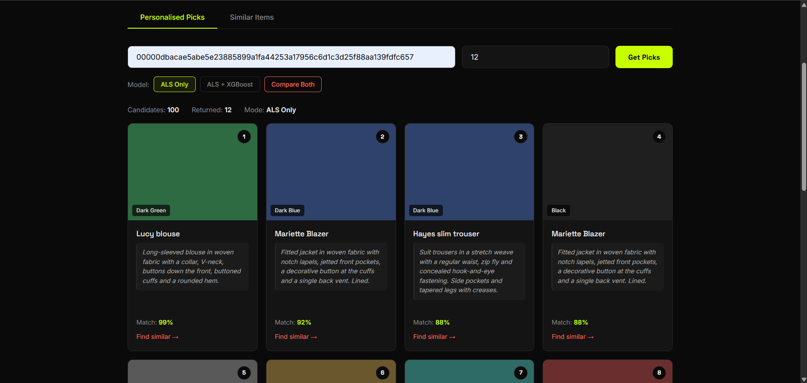
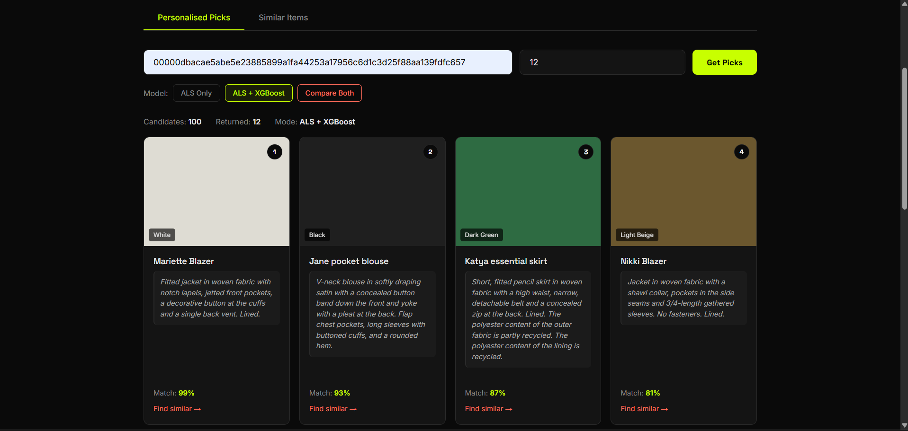
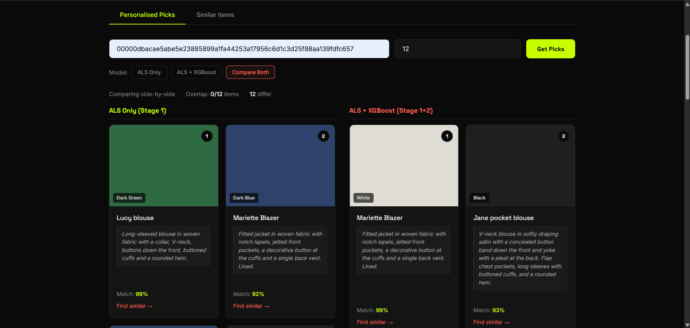
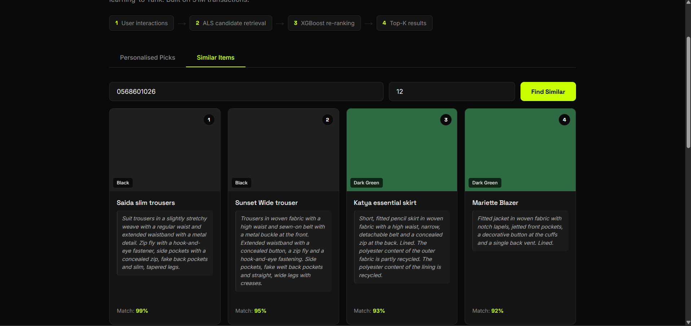

# Fashion Recommendation Engine

A production-grade two-stage recommendation system built on **31M transactions** from the H&M Personalized Fashion Recommendations dataset. Combines collaborative filtering (ALS) for candidate retrieval with XGBoost LambdaMART for re-ranking, served via FastAPI with an interactive A/B model comparison frontend.

Built as a portfolio project targeting ML Engineer roles in Search & Recommendations.

---

## 🚀 Live Demo

**[fashion-recsys-646227725228.europe-west2.run.app](https://fashion-recsys-646227725228.europe-west2.run.app)**

> First load takes ~2 minutes (cold start — 500MB of models loading into memory)

**Test customer ID:**
```
0001b0127d3e5ff8dadcfc6e5043682dba2070f2667081623faeb31c996242a6
```

**Test article ID (Similar Items tab):**
```
0739590032
```

---

## Architecture

The system follows the standard two-stage retrieval-ranking pattern used at production scale by companies like ASOS, Zalando, and Amazon Fashion.

```
User Request
     │
     ▼
┌──────────────────────────────────────┐
│  Stage 1: Candidate Generation       │
│  ALS (Alternating Least Squares)     │
│  · 128-dimensional user/item embeds  │
│  · 525K users × 42K items            │
│  · Confidence-weighted interactions  │
│  · Returns top 100 candidates        │
└──────────────────┬───────────────────┘
                   │
                   ▼
┌──────────────────────────────────────┐
│  Stage 2: Re-ranking                 │
│  XGBoost LambdaMART (rank:ndcg)     │
│  30 features across 4 groups:        │
│  · Collaborative: ALS score          │
│  · Item: popularity, recency, price  │
│  · User: activity, avg price, tenure │
│  · Cross: category affinity,         │
│           department match,          │
│           price compatibility        │
│  Returns top 12                      │
└──────────────────┬───────────────────┘
                   │
                   ▼
┌──────────────────────────────────────┐
│  FastAPI + Interactive Frontend      │
│  · ALS Only mode                     │
│  · ALS + XGBoost mode                │
│  · Side-by-side A/B comparison       │
│  · Similar Items (item-to-item ALS)  │
│  · Match % scoring                   │
│  · Deployed on GCP Cloud Run         │
└──────────────────────────────────────┘
```

---

## UI Walkthrough

### 1. Homepage — The Two-Stage Pipeline



The landing page surfaces the pipeline architecture directly in the UI — four steps showing how a user request flows from raw interactions through ALS retrieval, XGBoost re-ranking, and final top-K results. Three model toggle buttons let you switch between modes without reloading.

---

### 2. ALS Only Mode — Stage 1 Collaborative Filtering



With **ALS Only** selected, the system returns the top-12 items directly from the ALS candidate ranking. ALS uses matrix factorisation on 31M implicit purchase interactions to learn 128-dimensional user and item embeddings. The dot product of user and item vectors gives the relevance score, which is normalised to a match percentage for display.

Each card shows the product name, description, colour swatch, department tags, and match %. The "Find similar →" link chains into the Similar Items endpoint.

---

### 3. ALS + XGBoost Mode — Stage 2 Re-ranking



With **ALS + XGBoost** selected, the same 100 ALS candidates are passed to the XGBoost LambdaMART re-ranker, which scores them using 30 features across collaborative, item, user, and cross-feature groups. The top-12 by XGBoost score are returned.

Notice the ordering changes from ALS Only — the re-ranker promotes different items based on its learned feature weights. In this project's evaluation, ALS outperformed the re-ranker on NDCG@12, which led to the investigation described in the Results section below.

---

### 4. Compare Both — Live A/B Model Comparison



The **Compare Both** mode fires both models in parallel and renders them side-by-side. The overlap count at the top ("0/12 items, 12 differ") shows how many items appear in both ranked lists.

This is the most powerful demo feature — it visually demonstrates the effect of re-ranking on a single user's recommendations in real time. In production, this would be the basis for an A/B test: serve ALS to the control group, ALS+XGBoost to the treatment group, and measure CTR and conversion differences.

---

### 5. Similar Items — Item-to-Item ALS Similarity



The **Similar Items** tab uses ALS item factors directly — the cosine similarity between item embedding vectors surfaces products that co-occur in similar purchase patterns. This powers "People Also Viewed" and "Complete the Look" features.

Given a trouser article ID, the model surfaces other trousers and complementary bottoms — showing that the ALS embeddings have captured garment-type similarity purely from purchase co-occurrence, without any explicit product category labels.

---

## Results & Honest Evaluation

End-to-end evaluation on **temporal validation** (last 7 days of purchases). The pipeline retrieves ALS top-100 candidates, re-ranks them, and evaluates top-12 against what users actually bought the following week.

| Metric | ALS Only | ALS + XGBoost | Δ |
|---|---|---|---|
| Recall@12 | **0.2975** | 0.1772 | -0.1203 |
| Precision@12 | **0.0336** | 0.0200 | -0.0137 |
| MAP@12 | **0.1207** | 0.0512 | -0.0695 |
| NDCG@12 | **0.1678** | 0.0844 | -0.0833 |

### Why ALS outperforms the re-ranker

This was not the expected result. Feature importance analysis revealed the root cause:

```
XGBoost Feature Importance (gain):
  department_match        288.9  ← #1 (should not dominate)
  item_popularity_log     194.1  ← #2
  item_recency_days       186.1  ← #3
  als_score               166.0  ← #4 (should be #1)
```

XGBoost learned to promote **popular, recent items from the same department** — essentially a generic popularity recommender. This overrode the personalised ALS ordering, which was already the strongest signal.

This is a well-documented failure mode in two-stage systems: coarse re-ranking features replace the retrieval signal rather than refine it. The fix requires features the retrieval stage cannot capture — real-time session signals, sequential purchase patterns, or visual embeddings.

### Evaluation methodology progression

The project went through three evaluation stages, each more rigorous:

| Stage | Method | NDCG@12 | Issue |
|---|---|---|---|
| v1 | Random negatives, 80/20 split | 0.988 | Inflated — trivially easy negatives |
| v2 | Hard negatives, temporal split | 0.919 | Still inflated — small candidate set per user |
| v3 | End-to-end, ALS top-100 candidates | 0.168 | **Honest** — production-realistic |

The jump from 0.988 → 0.168 is not the model getting worse — it is the evaluation becoming honest.

---

## ML Pipeline Details

### Stage 1: ALS Candidate Generation

```python
model = AlternatingLeastSquares(
    factors=128,
    regularization=0.01,
    iterations=15,
)
# Confidence: 1 + 40 * log(1 + purchase_count)
```

- Trained on 3.9M transactions (last 90 days of a 2-year dataset)
- 525K users × 42K articles
- Sparsity: 99.98%
- Recall@100: ~6% — 6% of next-week purchases appear in top-100 candidates

### Stage 2: XGBoost Re-ranker

```python
params = {
    "objective": "rank:ndcg",
    "eval_metric": "ndcg@12",
    "monotone_constraints": (1, 0, 0, ...),  # ALS score monotonically increasing
}
```

- Hard negative mining from ALS top-200 (not random items)
- Monotone constraint ensures XGBoost refines rather than overrides ALS
- 30 features across collaborative, item, user, and cross dimensions
- Trained on 10K users, validated on temporal hold-out (3K users)

### Feature Engineering

| Group | Features |
|---|---|
| Collaborative | ALS score (user · item embedding dot product) |
| Item | log(purchase count), log(unique buyers), days since last purchase, avg price |
| User | log(total purchases), unique items bought, avg spend, days since last purchase |
| Cross | Price diff, price ratio, category affinity, department match |
| Article metadata | Product type, colour group, department, section, garment group, index code |

---

## Project Structure

```
fashion-recommendation-engine/
├── 01_data_prep.py              # Data loading, filtering, ID encoding, train/val split
├── 02_train_candidate_gen.py    # ALS training, Recall@K evaluation
├── 03_train_ranker.py           # XGBoost ranker: hard negatives, MLflow, full metrics
├── 05_precompute_features.py    # Pre-compute behavioral features for deployment
├── app.py                       # Production FastAPI (loads from deploy_data/)
├── index.html                   # Frontend with ALS/XGBoost/Compare modes
├── Dockerfile                   # GCP Cloud Run deployment
├── requirements.txt             # Pinned Python dependencies
├── pyproject.toml               # Project config (uv)
├── screenshots/                 # UI screenshots for README
├── fashion-recsys-deploy/       # Deployment package for GCP
└── processed/                   # Pre-computed artifacts
    ├── art2idx.json
    ├── idx2art.json
    ├── cust2idx.json
    ├── article_metadata.json
    └── article_features.parquet
```

---

## Experiment Tracking

All experiments tracked in MLflow with full parameter, metric, and artifact logging.

```bash
uv run mlflow ui --backend-store-uri sqlite:///mlflow.db
# Open http://localhost:5000
```

Key metrics logged per run: ALS baseline metrics, XGBoost metrics on temporal validation, feature importance JSON, score blending alpha sweep results, model artifacts.

---

## Quick Start

### Prerequisites

- Python 3.12
- [uv](https://astral.sh/uv) package manager
- H&M dataset from [Kaggle](https://www.kaggle.com/competitions/h-and-m-personalized-fashion-recommendations/data)

### Setup

```bash
git clone https://github.com/VatsalSangani/fashion_recommendation_engine.git
cd fashion_recommendation_engine

uv init --name hm-recsys
uv venv
source .venv/bin/activate  # Windows: .venv\Scripts\activate

uv add fastapi "uvicorn[standard]" numpy==2.5.1 scipy==1.18.0 pandas==2.3.3 \
       implicit==0.7.3 xgboost==3.3.0 scikit-learn joblib pyarrow==24.0.0 mlflow

mkdir data models
# Place transactions_train.csv, articles.csv, customers.csv in data/
```

### Train

```bash
uv run python 01_data_prep.py            # ~2 min — data prep
uv run python 02_train_candidate_gen.py  # ~1 min — ALS training
uv run python 03_train_ranker.py         # ~5 min — XGBoost + evaluation
```

### Serve locally

```bash
uv run uvicorn app:app --port 8000
# Open http://localhost:8000
```

### Deploy to GCP Cloud Run

```bash
uv run python 05_precompute_features.py   # pre-compute features

cd fashion-recsys-deploy

gcloud run deploy fashion-recsys \
  --source . --port 8000 --memory 2Gi --cpu 1 \
  --region europe-west2 --allow-unauthenticated \
  --min-instances 0 --max-instances 1 \
  --timeout 600 --clear-base-image
```

> `--min-instances 0` scales to zero when idle — zero cost when not in use.

---

## API Endpoints

### `POST /recommend`

```json
{
  "customer_id": "0001b0127d3e5ff8...",
  "n_candidates": 100,
  "n_results": 12,
  "ranking_mode": "als_only"
}
```

`ranking_mode`: `"als_only"` or `"als_xgboost"`

### `POST /similar-items`

```json
{
  "article_id": "0739590032",
  "n_results": 12
}
```

---

## Dataset

[H&M Personalized Fashion Recommendations](https://www.kaggle.com/competitions/h-and-m-personalized-fashion-recommendations) — Kaggle

| | |
|---|---|
| Total transactions | 31,788,324 |
| Total customers | 1,371,980 |
| Total articles | 105,542 |
| Date range | Sep 2018 – Sep 2020 |
| Training window | Last 90 days → 3.9M txns |
| Validation | Last 7 days → 240K txns |

---

## Tech Stack

| Component | Technology |
|---|---|
| Candidate generation | ALS via [implicit](https://github.com/benfred/implicit) 0.7.3 |
| Re-ranking | XGBoost 3.3.0 (LambdaMART) |
| Experiment tracking | MLflow |
| API | FastAPI 0.139.0 |
| Package management | uv (Rust-based) |
| Deployment | GCP Cloud Run + Docker (python:3.12-slim) |
| Language | Python 3.12 |

---

## What I'd Do Next

**1. Sequential modeling**
Replace ALS with SASRec or BERT4Rec to capture the order of purchases, not just co-occurrence. ASOS's JD specifically mentions sequence-based modelling — this is the highest-impact next step.

**2. Real-time session features**
Add clicks, dwell time, and add-to-cart signals at inference time. These are exactly what the re-ranker needs to add value over retrieval — features ALS cannot see.

**3. Visual similarity**
Use CNN embeddings from H&M product images as ranking features. This enables "visually similar" recommendations and is directly relevant to ASOS's outfit generation work.

**4. Feature store**
Move pre-computed user/item features to Redis for sub-millisecond lookup, replacing the current JSON file loading at startup.

**5. Online evaluation**
Build an A/B testing framework measuring CTR, conversion rate, and revenue per session — the business metrics that matter, not just offline NDCG.

---

## Key Learnings

- **Honest evaluation matters more than impressive metrics.** NDCG went from 0.988 → 0.168 as the evaluation became production-realistic. The lower number is the correct number.
- **Re-rankers only add value over features retrieval cannot capture.** Static item/user features (popularity, department) don't help when ALS already captures personalised preference.
- **Hard negatives are essential.** Random negatives (baby socks vs hoodie) produce trivially easy training — ALS candidates as negatives (Adidas vs Nike hoodie) force meaningful learning.
- **Temporal splits are non-negotiable.** Random splits leak future information. Evaluating on the next 7 days of actual purchases is the only honest measure of recommendation quality.

---

## License

Portfolio and educational use. The H&M dataset is subject to [Kaggle's competition rules](https://www.kaggle.com/competitions/h-and-m-personalized-fashion-recommendations/rules).
